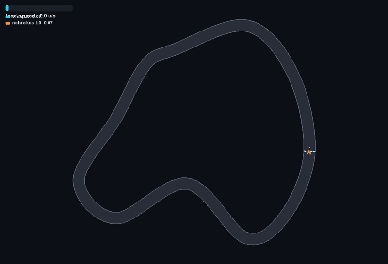
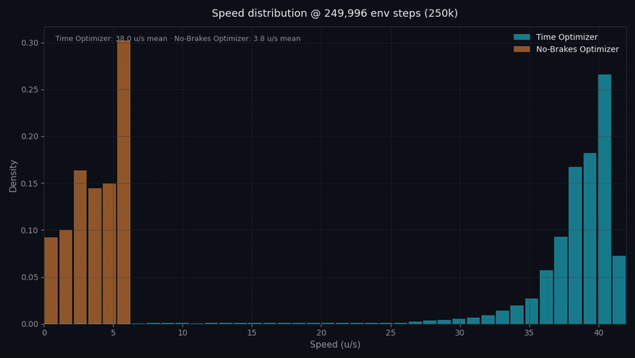
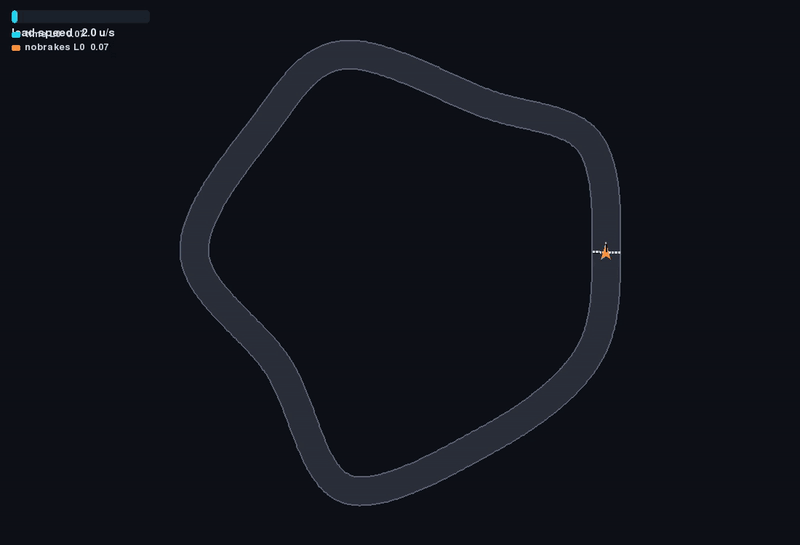
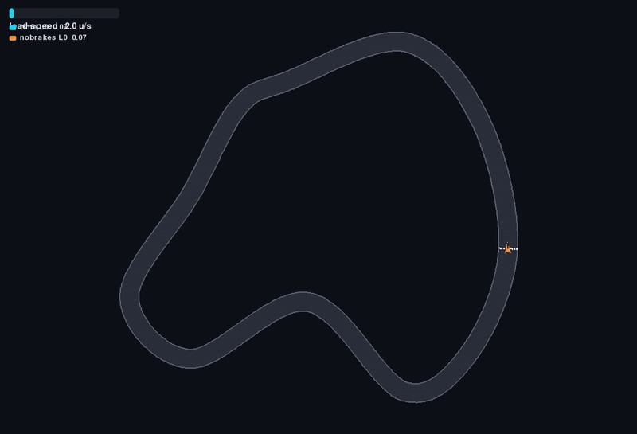

# Racing AI Experiment — Reward Shaping Comparison

A little experiment on how learning objectives shape AI behavior.



*Main-report intro. Cyan is `time`, orange is `nobrakes`. [MP4](report/assets/videos/intro_overlay.mp4) · [web report](https://cochon123.github.io/racing-AI-experiment/report/)*

Two identical PPO agents learn to drive a top-down 2D racing game on procedurally
generated tracks. The **only** difference between them is the reward function:

| Agent | Color | Reward |
|---|---|---|
| `time` | cyan | progress along track + lap bonus − small time penalty |
| `nobrakes` | orange | same, **minus** an aggressive penalty proportional to any deceleration |

Hypothesis: both learn to race, but their speed distributions diverge — `time`
brakes hard into corners, `nobrakes` carries speed and drifts instead of slowing
down, possibly at the cost of lap time on tight tracks.

## Setup

Requires Python 3.12+ with a CUDA-enabled `torch` already installed, then:

```bash
pip install -r requirements.txt
```

## Commands

```bash
python -m racing play --seed 7          # drive yourself (arrows, R reset, ESC quit)
python -m racing race --vs nobrakes     # you vs a trained AI, same track
python -m racing watch --seed 3         # AI vs AI, live overlay
python -m racing newtrack --seed 42     # preview a generated track
python -m racing train --agent both     # train both agents (PPO)
python -m racing evaluate               # run held-out tracks, build dataset/
python -m racing report                 # render videos + charts, serve web report
python -m racing selftest               # headless sanity checks
```

## Layout

- `racing/` — game core (track generator, drift physics, renderer), gym env, training, evaluation
- `runs/` — model checkpoints and training logs
- `dataset/` — evaluation telemetry (`telemetry.csv`, `summary.json`)
- `report/` — static web report (open via `python -m racing report`)
- `docs/media/` — short GIF loops embedded above and below (the full MP4s stay in `report/`)

## Reports (GitHub Pages)

After deploy, the static reports are served from the `report/` folder:

- [Main experiment — reward shaping comparison](https://cochon123.github.io/racing-AI-experiment/report/)
- [Archive: flat tracks (null result)](https://cochon123.github.io/racing-AI-experiment/report/archives/flat-tracks/)
- [Archive: reverse exploit (reward hack)](https://cochon123.github.io/racing-AI-experiment/report/archives/reverse-exploit/)

The loops below are the short report intros and the speed-histogram replay. Captions link the source MP4; the pages above play every clip with the charts.

### Main experiment



*Speed histograms replayed at each training checkpoint. [MP4](report/assets/videos/speed_distribution_evolution.mp4) · [report](https://cochon123.github.io/racing-AI-experiment/report/)*

### Flat tracks (null result)



*Flat-tracks intro. Cyan (`time`) and orange (`nobrakes`) take nearly the same line — the baseline versus the shaped reward, on circuits that never forced a brake. [MP4](report/archives/flat-tracks/assets/videos/intro_overlay.mp4) · [report](https://cochon123.github.io/racing-AI-experiment/report/archives/flat-tracks/)*

### Reverse exploit (reward hack)



*Reverse-exploit intro. Same start, then the policies diverge: cyan races forward and the no-brakes car drives the lap in reverse. [overlay MP4](report/archives/reverse-exploit/assets/videos/intro_overlay.mp4) · [no-brakes solo](report/archives/reverse-exploit/assets/videos/track_1003_nobrakes_solo.mp4) · [time solo](report/archives/reverse-exploit/assets/videos/track_1003_time_solo.mp4) · [report](https://cochon123.github.io/racing-AI-experiment/report/archives/reverse-exploit/)*

<details>
<summary>All report MP4s</summary>

Main experiment (`report/assets/videos/`):

- [intro_overlay.mp4](report/assets/videos/intro_overlay.mp4)
- [speed_distribution_evolution.mp4](report/assets/videos/speed_distribution_evolution.mp4)
- [track_1000_overlay.mp4](report/assets/videos/track_1000_overlay.mp4)
- [track_1001_overlay.mp4](report/assets/videos/track_1001_overlay.mp4)
- [track_1002_overlay.mp4](report/assets/videos/track_1002_overlay.mp4)
- [track_1003_overlay.mp4](report/assets/videos/track_1003_overlay.mp4)
- [track_1004_overlay.mp4](report/assets/videos/track_1004_overlay.mp4)
- [track_1005_overlay.mp4](report/assets/videos/track_1005_overlay.mp4)
- [track_1006_overlay.mp4](report/assets/videos/track_1006_overlay.mp4)
- [track_1007_overlay.mp4](report/assets/videos/track_1007_overlay.mp4)

Flat tracks (`report/archives/flat-tracks/assets/videos/`):

- [intro_overlay.mp4](report/archives/flat-tracks/assets/videos/intro_overlay.mp4)
- [track_1000_overlay.mp4](report/archives/flat-tracks/assets/videos/track_1000_overlay.mp4)
- [track_1001_overlay.mp4](report/archives/flat-tracks/assets/videos/track_1001_overlay.mp4)
- [track_1002_overlay.mp4](report/archives/flat-tracks/assets/videos/track_1002_overlay.mp4)
- [track_1003_overlay.mp4](report/archives/flat-tracks/assets/videos/track_1003_overlay.mp4)
- [track_1004_overlay.mp4](report/archives/flat-tracks/assets/videos/track_1004_overlay.mp4)
- [track_1005_overlay.mp4](report/archives/flat-tracks/assets/videos/track_1005_overlay.mp4)
- [track_1006_overlay.mp4](report/archives/flat-tracks/assets/videos/track_1006_overlay.mp4)
- [track_1007_overlay.mp4](report/archives/flat-tracks/assets/videos/track_1007_overlay.mp4)

Reverse exploit (`report/archives/reverse-exploit/assets/videos/`):

- [intro_overlay.mp4](report/archives/reverse-exploit/assets/videos/intro_overlay.mp4)
- [track_1000_overlay.mp4](report/archives/reverse-exploit/assets/videos/track_1000_overlay.mp4)
- [track_1001_overlay.mp4](report/archives/reverse-exploit/assets/videos/track_1001_overlay.mp4)
- [track_1002_overlay.mp4](report/archives/reverse-exploit/assets/videos/track_1002_overlay.mp4)
- [track_1003_overlay.mp4](report/archives/reverse-exploit/assets/videos/track_1003_overlay.mp4)
- [track_1003_nobrakes_solo.mp4](report/archives/reverse-exploit/assets/videos/track_1003_nobrakes_solo.mp4)
- [track_1003_time_solo.mp4](report/archives/reverse-exploit/assets/videos/track_1003_time_solo.mp4)
- [track_1004_overlay.mp4](report/archives/reverse-exploit/assets/videos/track_1004_overlay.mp4)
- [track_1005_overlay.mp4](report/archives/reverse-exploit/assets/videos/track_1005_overlay.mp4)
- [track_1006_overlay.mp4](report/archives/reverse-exploit/assets/videos/track_1006_overlay.mp4)
- [track_1007_overlay.mp4](report/archives/reverse-exploit/assets/videos/track_1007_overlay.mp4)

</details>
